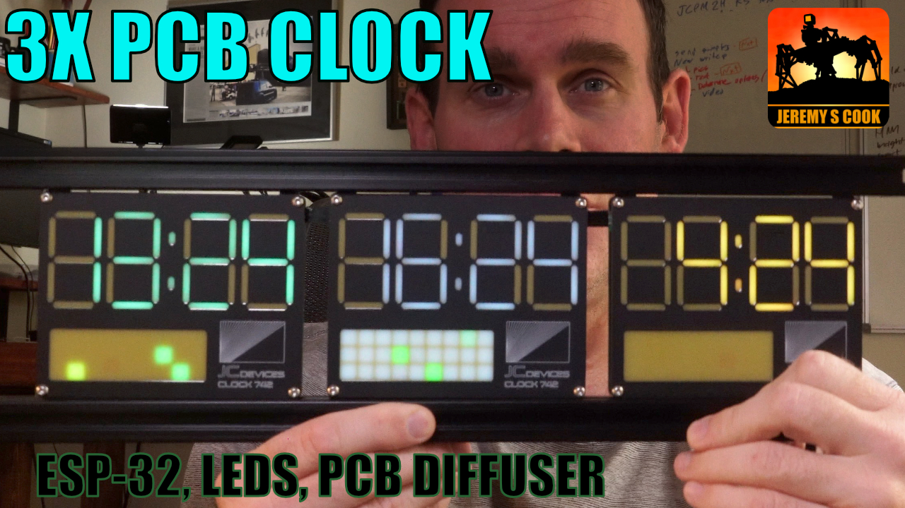

# Clock 742
Clock 742 is a clock made with a PCB diffuser

Video (single): https://www.youtube.com/watch?v=BssHpYaKQ-s  
Video (tripple-zone): https://www.youtube.com/watch?v=XAtKZ0VzOI4

NTP code/background: https://randomnerdtutorials.com/esp32-date-time-ntp-client-server-arduino/  
ESP32 touch sensor code/background: https://microcontrollerslab.com/esp32-touch-sensor-button-example/

 
